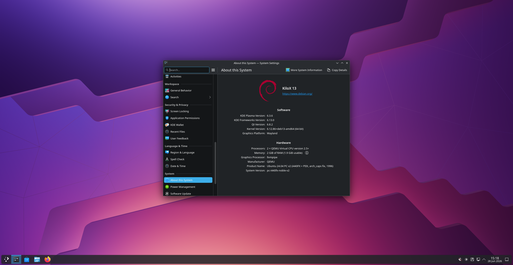

# KiloX
KiloX is a modern Linux distribution built on Debian 13 (Trixie) with the KDE Plasma desktop environment.

# Why choose us?
**We're fully open source**, the code is available for anyone to use or modify under the GPL 2.0 license.

**We are simple**, there is no bloat. just a working system.

**Community-driven**, Contributions and feedback are welcome.

*SCREENSHOT MAY BE TAKEN FROM A OLDER BUILD*

**How to run the OS?**

You run the OS via this command:

*qemu-system-x86_64 \
    -kernel /mnt/kilox_img/boot/vmlinuz-6.12.86+deb13-amd64 \
    -initrd /mnt/kilox_img/boot/initrd.img-6.12.86+deb13-amd64 \
    -append "root=/dev/vda rw" \
    -drive file=kilox.img,format=raw,if=virtio \
    -m 2G \
    -enable-kvm \
    -smp 2 \
    -vga virtio \
    -display gtk*  
